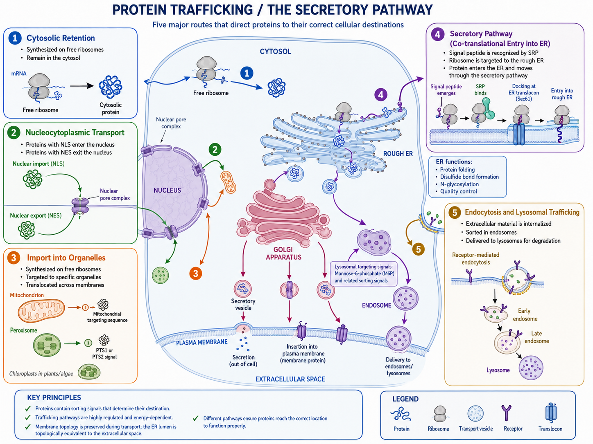

# Protein Trafficking / The Secretory Pathway

> Related: [mhc-antigen-presentation-pathways.md](mhc-antigen-presentation-pathways.md)

---

## 1. Summary

Protein trafficking means that proteins are transported to the correct cellular location after or during synthesis.

## 2. Main routes

| Type | Name | Main destination | Membrane crossing? | Typical signal |
|------|------|--------|-------|--------|
| 1 | Free ribosome synthesis and cytosolic retention | Cytosolic protein | No | Usually no special signal |
| 2 | Nucleocytoplasmic transport | Nucleus ↔ cytosol | Through nuclear pores, not through membrane | NLS; NES |
| 3 | Import into mitochondria, chloroplasts, or peroxisomes | Mitochondria, chloroplasts, peroxisomes | Usually requires translocation across membranes | Mitochondrial targeting sequence, PTS1/PTS2 |
| 4 | Co-translational entry into ER and secretory pathway | ER → Golgi → plasma membrane/secretion/lysosome | Yes, into the membrane system | ER signal peptide, signal anchor |
| 5 | Endocytosis and lysosomal trafficking | Extracellular space → endosome → lysosome | Vesicular transport | Receptor signals, ubiquitination, M6P |

## 3. Key concepts

- Free ribosomes and ER-bound ribosomes are the same type of ribosome.
- Proteins with an ER signal peptide enter the secretory pathway.
- The ER lumen is topologically equivalent to the extracellular space.
- Cytosolic proteins are often linked to MHC I antigen presentation.
- Extracellular/endocytic proteins are often linked to MHC II antigen presentation.

## 4. Diagram

## 5. Confusing Points (Q&A)

### Question 1 — Do identical cells make identical proteins, and does the amino acid sequence decide the 3D structure?

**Original question (cleaned up):** "Cytosolic proteins are synthesized only on ribosomes. Does that mean two identical cells will produce the same type of protein? And does the sequence decide the protein's 3D structure?"

**Answer:**

- **Same genome ≠ same proteins at every moment.** Two cells of the same type share the same DNA, but which proteins they actually make depends on **gene expression** — which genes are switched on, how much mRNA is made, and the cell's current state (signals, cell cycle, stress). So the *potential* protein set is the same, but the *actual* set can differ.
- **Sequence largely determines structure.** The amino acid sequence drives folding into the 3D shape (Anfinsen's principle). But folding is often *assisted* by **chaperones**, and **post-translational modifications** (glycosylation, phosphorylation, disulfide bonds) and the local environment can further shape the final, functional structure.

### Question 2 — Do all secreted proteins go through the ER?

**Answer:** **Mostly yes, but not all.**

- The **classical secretory pathway** is `ER → Golgi → secretory vesicle → outside`. Most secreted and membrane proteins use this route, entering the ER co-translationally via an **ER signal peptide**.
- However, some proteins use **unconventional (ER/Golgi-independent) secretion** — for example certain cytokines such as **IL-1β** and **FGF2** — which leave the cell without passing through the ER.

> **Rule of thumb:** "Has an ER signal peptide → goes through the ER." A few special proteins are exported by other mechanisms.
